# Important notice: The main branch version 0.1.2 currently has an issue in the pcb.
The mistake shorts GND and RST together, which leads to permanent resetting of the controller on the right side ( **left side is not affected** ). I am currently updating the PCB to fix this issue. Apologies for everybody affected by this. Do not order new PCBs until this notice is gone. Fix is being tracked on this [branch](https://github.com/vuoz/chalk/tree/fix01)   
#### This only affects version 0.1.2 of the PCB
## Workaround for Version 0.1.2
There is a workaround which will make your keyboard usable:
Do not solder the top underside pads for the right side pcb for the connection the microcontroller.    
This means that your right reset switch does not work, but since you only have to flash the right side once (if left is your central, which is the most common approach) this should be an acceptable workaround.
If you ever need to reset your right side you can use the reset switch on on the microcontroller itself. This obviously comes with an inconvienience. For debugging your firmware I would leave the right board disassembled.

## Fix progress
- [x] Issue was identified
- [x] New PCB version is on the [fix01 branch](https://github.com/vuoz/chalk/tree/fix01)
- [x] PCBs are ordered
- [ ] Verify new PCBs
- [ ] Verify and update Firmware
- [ ] Merge fix

# Chalk, an ultra low profile split keyboard 

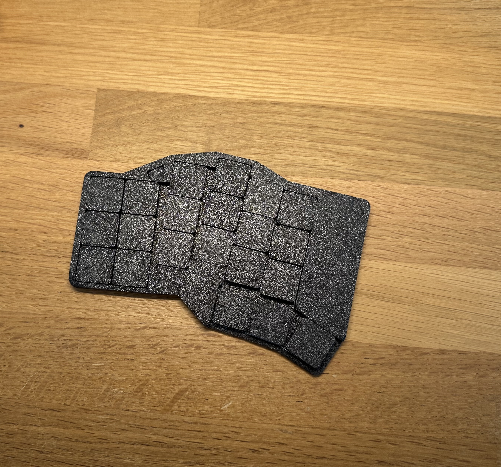
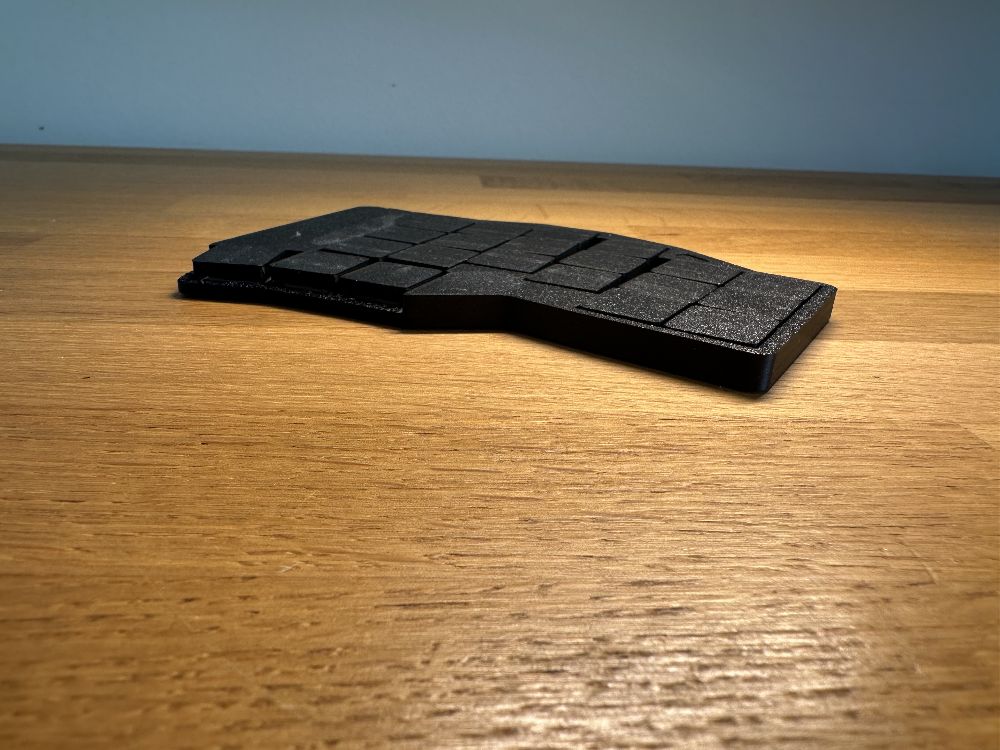
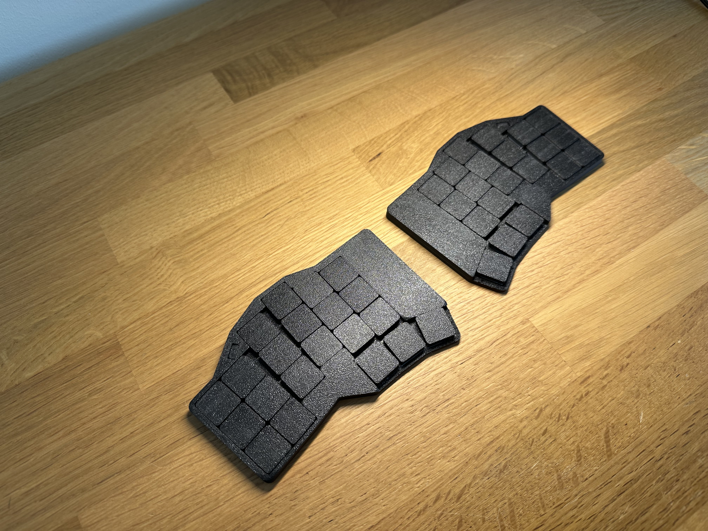
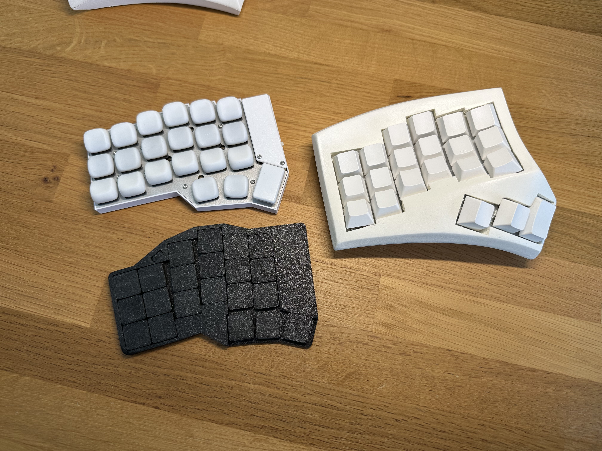
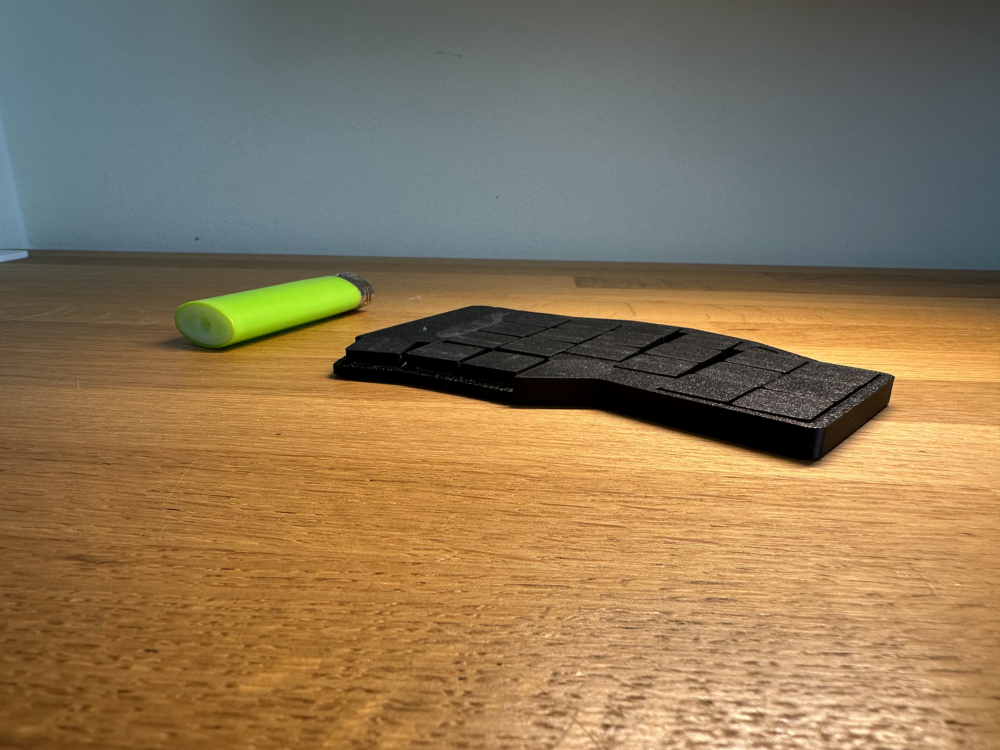

### Features
- Ultra low profile, 6mm thickness
- Zmk + Zmk Studio support
- Big 250mah Battery per split
- Hand solderable
- 42 key layout
- extremely light and portable

### Quick note about the license
This work is licensed under a
[Creative Commons Attribution-NonCommercial-ShareAlike 4.0 International License](https://creativecommons.org/licenses/by-nc-sa/4.0/).
#### This means:
- You are free to share and adapt this work, as long as you give appropriate credit
- If you adapt this work, you have to share it under the same license
- You cannot use this work for commercial purposes
- **If you just want to build this keyboard for yourself, you are totally free to do so.**

### Disclaimer (s)

- Even though this can be hand soldered, this is an advanced project, if you have never built a keyboard I would advise against this being your first project
- You will need a good soldering iron and well flowing solder, but please use lead free. Flux helps with the soldering process, so be sure to have it on hand.
- Make sure to work in a well ventilated area and wash your hands afterwards.
- These switches are super unforgiving. You will most likely not be able to desolder these once attached. Take you time and be aware that one simple mistake could ruin the whole board
- The battery is quite a tight fit. Some varients might not fit perfectly, others will. Mathematically it should, but small deviations in size might affect the fit.

## Ordering guide for the PCB
- Find the files in the /gerber folder,create a zip file and upload it to you PCB manufacturer of choice.
- Specs:
    - 1mm thickness ( the case is designed for a 1mm thick PCB ) 
    - lead free HASL ( not required but recommended )
    - Choose any color you like, but green will be cheapest in the Lead free HASL + 1mm thickness combination. If you pick an undisireable color, you will need to print a silkscreen cover and apply it with glue to the pcb later.

### More convenient option

**Disclaimer: this is experimental, proceed with caution and on your own financial risk. I have not yet fully verified all the details. Once this is fully tested this note will disappear.**

There is also an option to order the PCB partly preassembled using PCBA. I have only tested this with JLC. 
You can get the pcb presoldered with diodes, power and reset switch, so you only have to solder MCU, switches and the battery. This does increase the cost by a bit, but especially soldering the diodes is quite tedious, which is why one might opt for this option.

#### Approach:
- Order one batch of PCBs with top side PCBA
- Order another batch PCBs with bottom side PCBA

#### Disclaimers
- This increases the cost of the PCBs quite a bit and is not really worth it for a single board, because the setup cost for PCBA will occure twice, since you are ordering two batches. If you order more boards or plan on ordering with friends this approach can be totaly worth it. 
- For my test I ordered PCBs for 10 full boards, which cost around 100$ with PCBA. Decreasing quantity to 5 boards does not really reduce the cost by much, since the setup fees and egineering fees are the most expensive part of the order.

#### Steps
1. Upload the gerber (also use the gerber zip files in the /production_files directory) files to your PCB manufacturer
2. Select 1mm thickness, lead free HASL and your color of choice
3. Select PCBA and Top side assembly and click "Added by customer" for the "tooling holes option"
4. Upload the  BOM and CPL ( **use "CPL_reversible.csv"** ) files found in the /production_files folder
5. Follow the steps and visually confirm that all the parts are placed correctly. If you spot any anomalies, open an issue

**Now we reapeat this for the bottom side**

1. Upload the gerber files  (also use the gerber zip files in the /production_files directory) to your PCB manufacturer
2. Select 1mm thickness, lead free HASL and your color of choice
3. Select PCBA and bottom side assembly and click "Added by customer" for the "tooling holes option"
4. Upload the BOM and CPL ( **use "CPL_reversible_bottom.csv"** ) files found in the /production_files folder
5. Follow the steps and visually confirm that all the parts are placed correctly. If you spot any anomalies, open an issue

## Build guide

### Bom
- 1x PCB (find the files in /gerbers)
- 2x XIAO nrf52840
- 2x [250Mah Battery](https://www.amazon.de/dp/B0CRQCCT6C)
- 42x 1N4148W SMD Diodes
- 42x PG1316s switches (buy at least 50, to have some spares)
- 42x PG1316s keycaps 
- 2x [Reset switch](https://42keebs.eu/shop/parts/components/reset-switch/?attribute_type=Through-hole%202-pin%206x3&attribute_pa_colour=black)
    - As of  PCB version 0.1.2 I have dicided to go with a thinner reset switch. It can be found on amazon in this [kit](https://www.amazon.de/dp/B08JQ2WS7D)
    - This is the switch you are looking for once you have received the kit:   
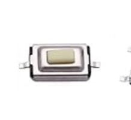

- 2x [Power switch](https://42keebs.eu/shop/parts/components/power-switch/)
- 8x [M2 3mm depth x 3.5 mm theaded inserts](https://www.amazon.de/dp/B0D9YK4PY1)
- 8x [M3 3mm flat head screws](https://www.amazon.de/dp/B0D4557749)
- 1x Left top part of the case
- 1x Right top part of the case
- 1x Left bottom part of the case
- 1x Right bottom part of the case
- 2x Reset switch cover

### Build guide

#### Printing guide for the case.
- Use a 0.2 nozzle. This is necessary to get enough detail.
- Print everything with the highest quality settings. 
- Print the top part of the case with the top of the case facing down ( therfore Y-axis rotated by 180 degrees ), this improves the finish of the case.

 
#### Credits
- base for this keycap is the convexfoam model by mikeholsher
-  I added supports / standoffs for the switch legs to rest on in the edges and decreased the overall height of the keycap to 3mm.

#### Buidling steps

##### Disclaimer
Most images in this guide were taken with an earlier version of the PCB, but the steps still apply. So don't worry if yours looks different. 

1. To solder the diodes, first put a blob of solder on one of the pads. 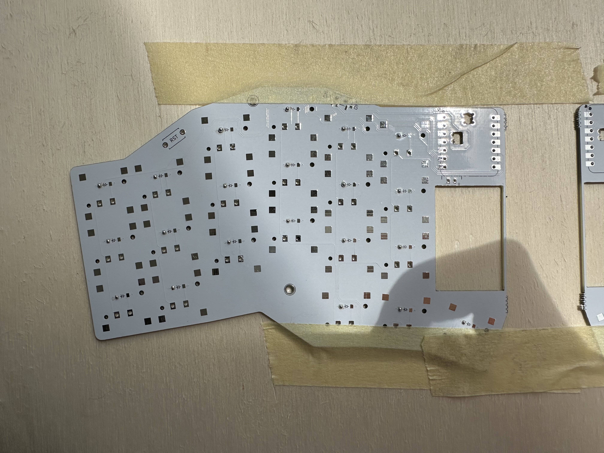
2. Sort the diodes by direction. **This is very important**. Make sure the line on the diode on one side of them is lining up with the line on the PCB, where the diodes should go . 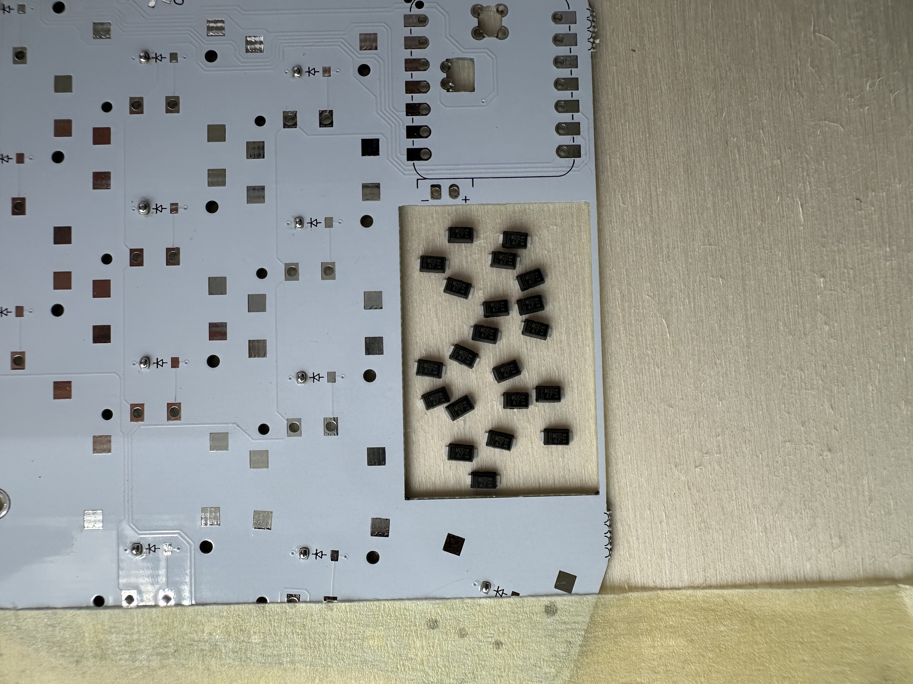
3. Pick up a dioded with your tweezers and while reheating the blob of solder on the PCB, place the diode ( while presevering the correct direction) on the pad. Once you have attached all the diodes on one side, you can add solder to the other pad.    
4. Once you have all diodes attached, touch up all the solder joints by reheating and removing excess solder. **This is very important, because the room underneath the switch is quite limited and too much solder on the diode pads will prevent the switch from being inserted properly.** 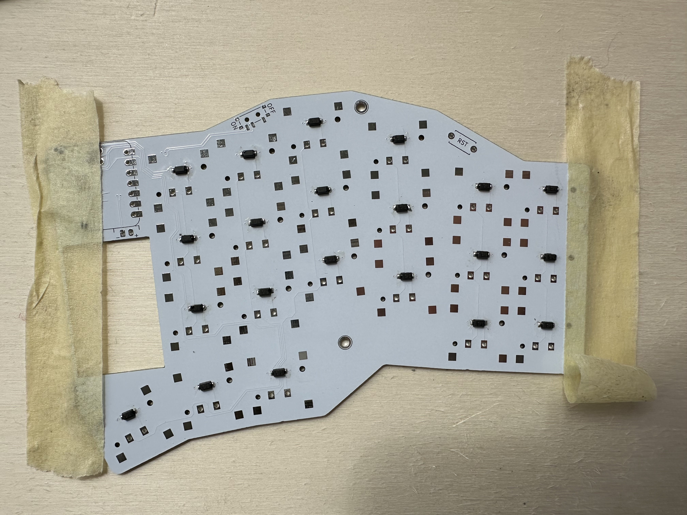
5. Now we will attach the controller. The controller should come with a pair of headers. These can be very handy to fix the controller in place while soldering. Place the controller on top of the PCB then place the package on a breadboard and then stick the headers through the pads, this keeps the controller in place while soldering.  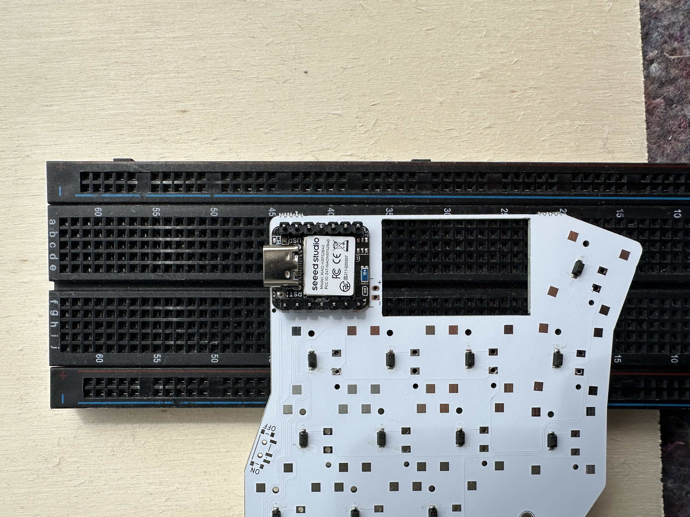
6. To solder the controller, only attach solder on the side of the controller. Turn down your soldering iron's temperature to 330C max. You do not want to fry the controller. Do not try so solder where the headers are. Once a few solder joints have been made, you can carefully pull out the headers with a pair or tweezers. Now touch up all the solder joints and make sure that there are no cold joints.  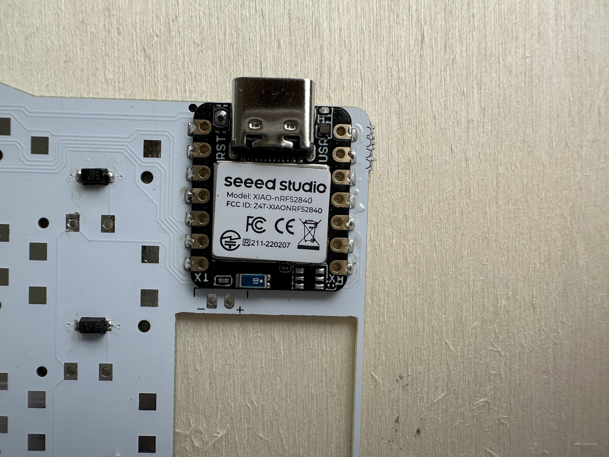 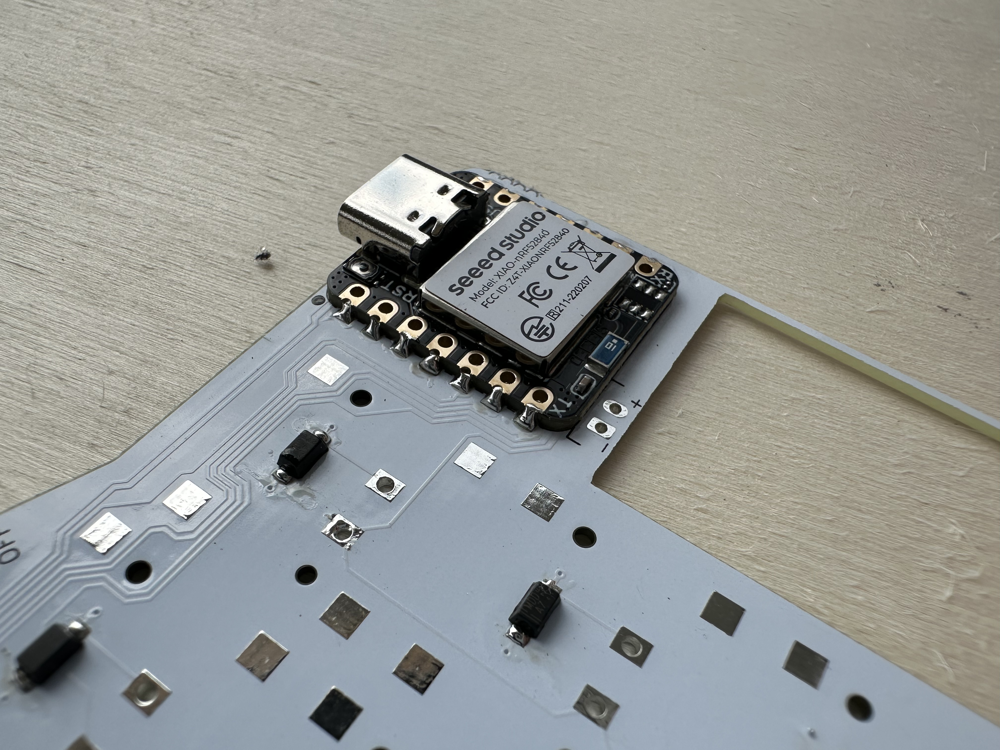
7. Now turn the PCB around and drop solder into the cutouts on the back of the pcb ( the cutouts for the controller ). These joint are necessary for the battery connection and the reset switch. 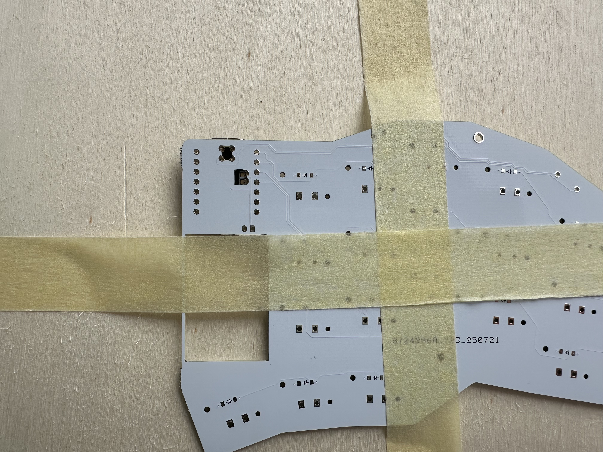 
8. Now to the hard part, the switches. Please be very careful here and take you time. Check everything twice before soldering. Place a column of switches on the front of the pcb. Make sure that all switches fall into the holes. If they are not placed correclty **do not solder**. Fix the alignment first. Once all switches in the column are in place, take a piece of tape and temporarely fix them in place. Now turn the board around and drop solder into the through holes on the back for the column you are soldering. It is really important that the solder flows well. Use a very well flowing solder and make sure it had time to flow fully. I used this [solder](https://www.amazon.de/gp/product/B0CG182RLW) and had my soldering iron at 400C. After you have filled all through holes for the column, test all connections with a multimeter. If the multimeter does not show continuity at this point, **you have to reflow the solder, until it shows continuity!** Now repeat that for all columns of the board.  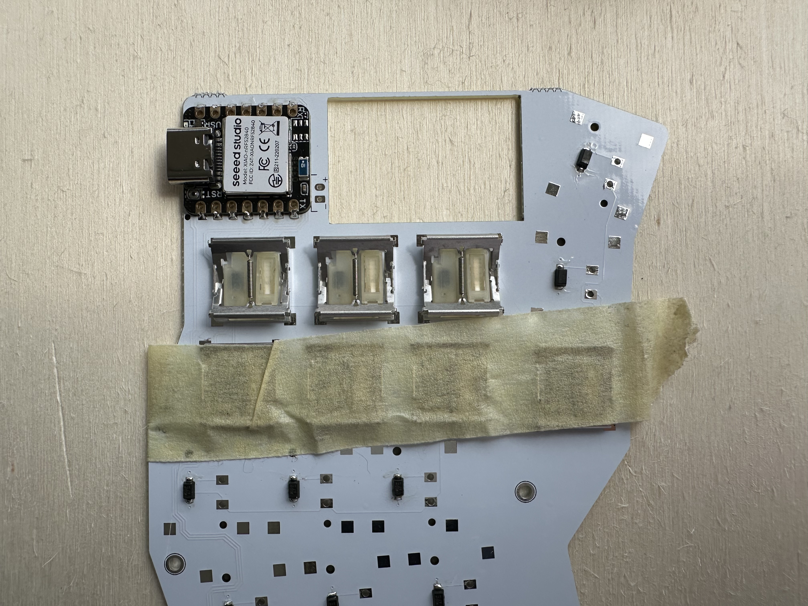
9. Once all the switches are attached from the back, you can now solder the front pads. **It is very important to only add a very tiny amount of solder to the pads, otherwise it will block the switches.  Less is more!!! This is very important.**  Using a thin soldering wire can help dose correctly. Using a thick soldering wire above 0.8mm will most likely make this process much harder. 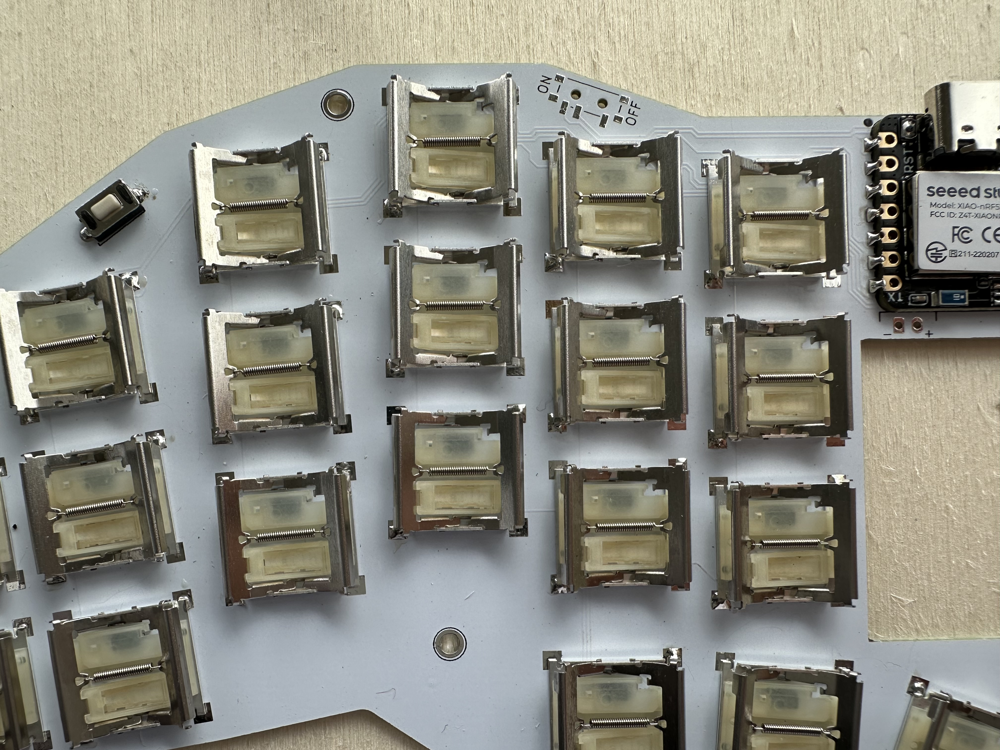
10. Now attach the reset switch. Place the legs through the through holes. Then add solder to the top of the through holes. Afterwards, make sure to cut the legs flush on the backside, otherwise they will interfere with the backplate. 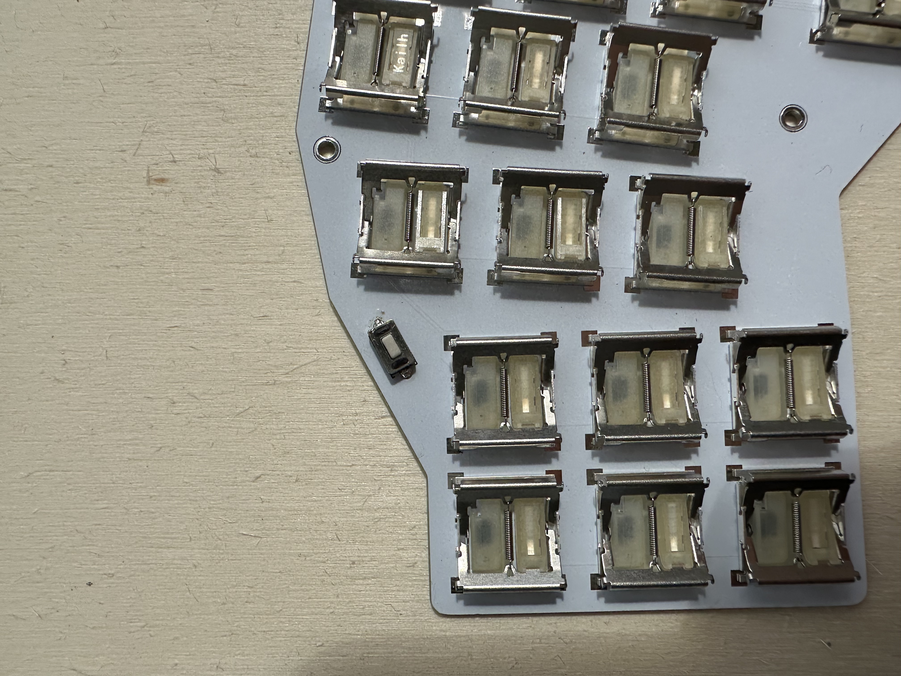
11. Now attach the power switch. Make sure not to use too much solder. The fit between case and power switch is quite tight. To solder the power switch, first put the power switch into its holes on the pcb. Hold it in place with a tweezer and add a bit of solder to one of the pads. Then add solder to all of the other pads.  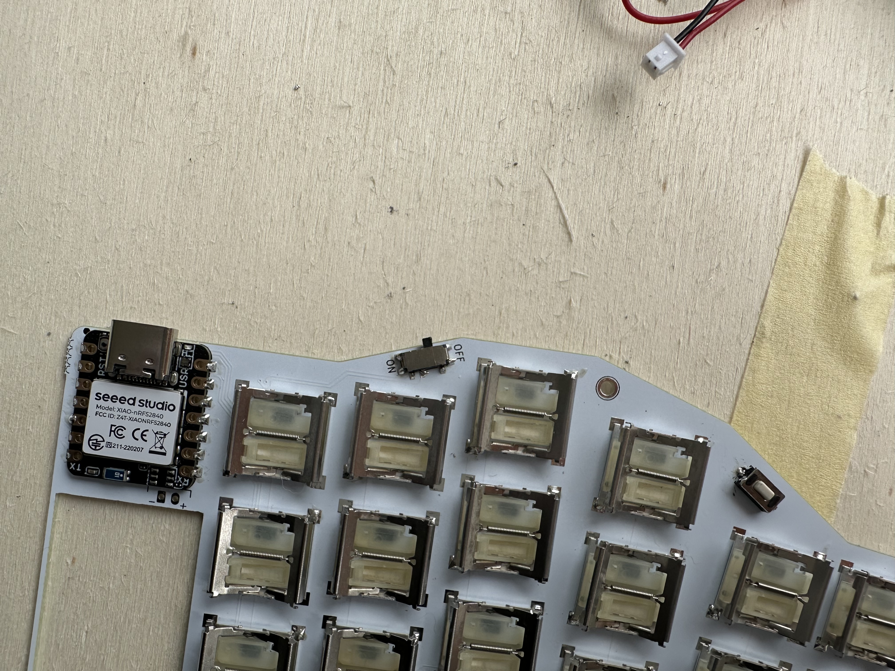
12. Now we will attach the battery. Make sure the battery cables are cut to lenght. There should not be too much slack, since that would use up too much space in the case. **Before soldering, please check the polarity on the battery.** Take the insulation of the ends of the cables and place them through the holes for the battery , then solder them in place. Turn the PCB around and cut of the excess of the cables. 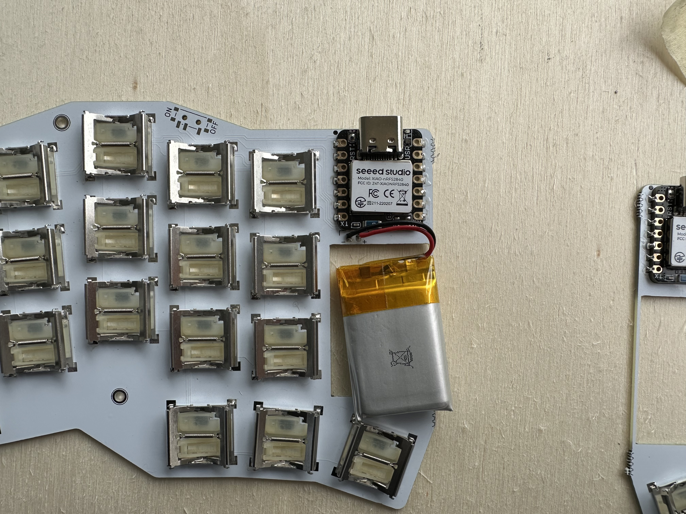
13. Repeat all the steps for the other half of the keyboard, by taking another PCB and flipping it around. Solder all components on this side, otherwise you end up with 2 left sides.
14. To attach the heated inserts, take the top part of the case and place the heated inserts in the preprinted holes. Use a big attachment for your soldering iron and set its temperature to 400C. Now slowly heat of the threaded insert until it sits flush with the case. Make sure that the heated inserts are level and did not twist or are not straight.  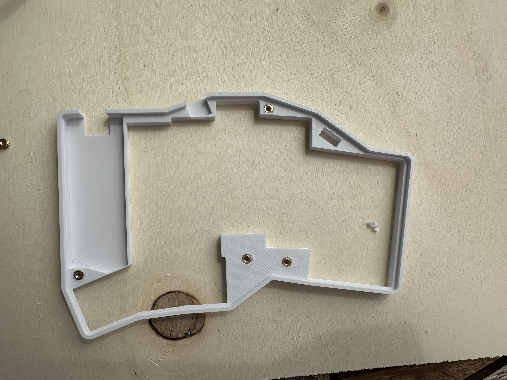
15. After the previous step, place the top case on top of the pcb, turn it around and attach the bottom part of the case with the M2 screws.  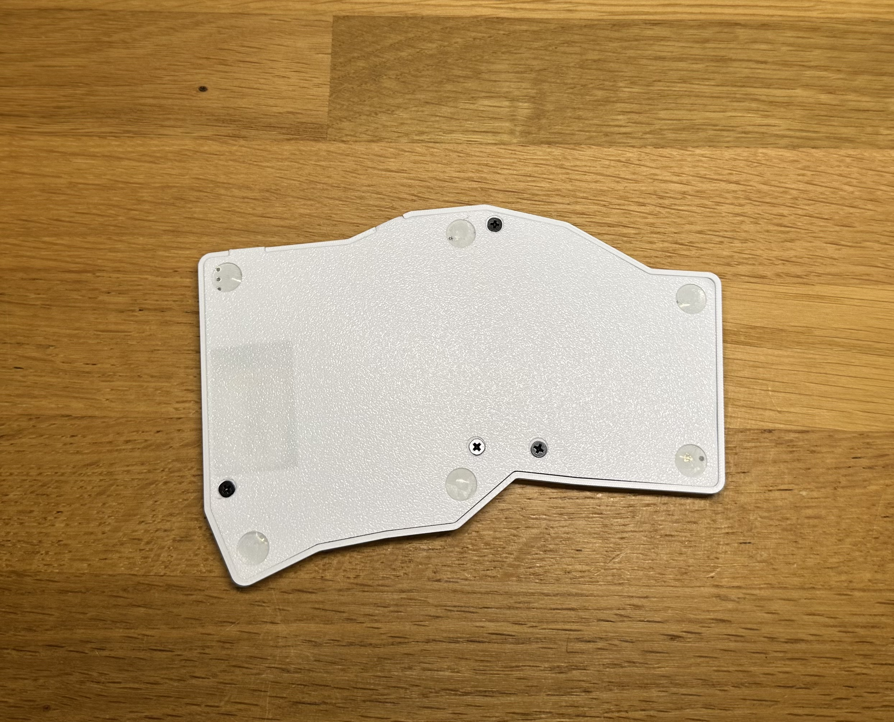
16. **Optional** Silkscreen cover: Print your silkscreen covers with maximal accuracy and carefully remove them from the printplate, they can rip easily. Take you already assebled board and brush the silkscreen (the white, green or black area depening on which color you ordered) around the switches with glue, making sure not to miss any spots or glue any of the plasitc parts of the switch 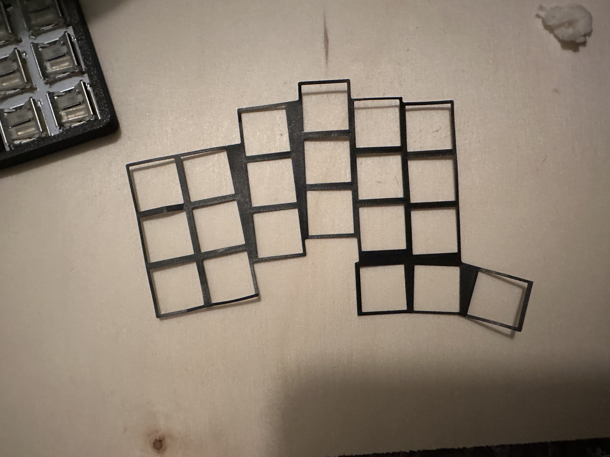
Now carefully place the silkscreen cover on top of the glue you just applied and press down with a pair of tweezers to ensure proper adhesion. Make sure it is aligned properly with the case and there are no uncoverd areas poking through. You may wonder about the order of operations. Having the case screwed in already, while gluing the silscreencover ensures that the silscreen cover is placed correctly and avoids any misalignments. If there are loose spots around the edges you can unscrew the case and fix those by applying more adhesive to those spots. Though be carefuly not to shift the while silkscreen cover, while fixing small spots. 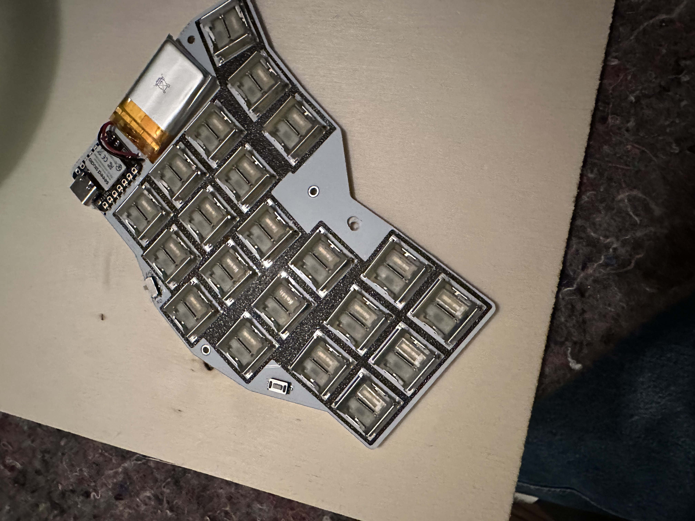
17. Now insert the rubber pads in the preprinted holes on the backplate. 
18. Repeat the case assembly for the other half of the keyboard.
19. Lastly, put a little bit of adhesive on on the button of the reset switch. Now attach the reset switch cover and press it down slightly. The stl files for the reset switch cover can be found in /3dfiles. Make sure to print them at the highest quality setting to ensure accuracy. 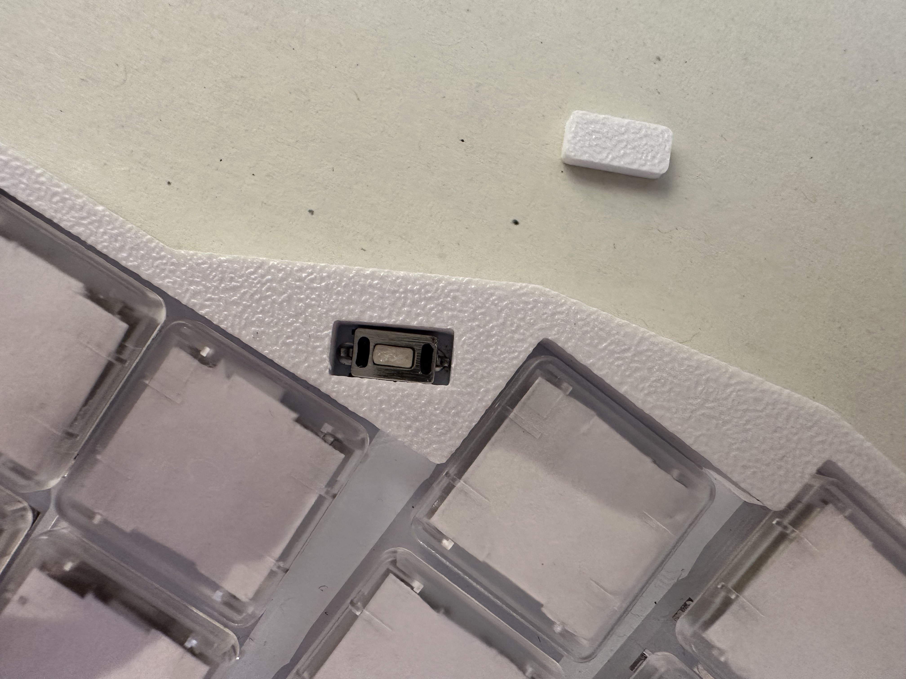

### Printing & using the custom keycaps
1. Find the keycap step files in the /3dfiles folder. Buy this 0.5 poron foam kit
    -  [0.5mm poron foam](https://amzn.eu/d/any7tR6)
2. Import into your slicer of choice
3. Select the highest resolution printing settings and with a 0.2mm nozzle
4. Orient the keycaps top side down
5. Scale keycap to: {x: 16mm y: 16.05mm}, though this might vary depending on printer and filament. I would recommend printing a grid of keycaps with differnt scaling combinations as a first fit test.
    - **make sure no to scale uniformly**
6. Print in small batches for higher consistency, I printed max 12 at a time. Printing all at once will lead to dimensions all over the place and havint to scrap the whole batch.
7. Cut of the top edge of the poron foam dampener then cut it in halve. Now place the foam inside the keycap making sure to cover the "bump" in the middle.
8. Carefully set the keycap on the switch and press down slightly.

#### Some notes about the custom keycaps
I have tried loads for different combinatations. From 0.3 bumps to 0.1mm bumps with 1mm or 0.5mm foam and so on, but that might be due to the foam not being self adhering and therefore moving around. 1mm self adhering foam could be worth a short for an even more silent switch.
- 1mm eva or poron foam will most likely be the most silent, but I had a hard time with consistency. The switch feel is all over the place. 
- 0.5mm adhesive poron foam in these precut kits for keyboards has worked the best for me. They are easy to cut and apply and achieve nearly the same result as the 1mm eva foam in its best form.
- For now I have settled on the 0.5mm adhesive poron foam approach, as this seems to be the most viable and achievable for most people. Furthermore these keyboard 0.5mm poron foam kits are widely available.

##### Managing expectations for sound and feel
- These won't sound "thocky", I am sorry to break it to you. 
- Out of the box they have a harsh bottom out and a tactile sound thats just horrible.
- I believe the direction for more pleasant sound is in the silent direction. So that is what I have been trying to work towards.

### Keycap removal 
#### Requirements
- Have a bend pair of tweezers ready. These making grabbing under the keycap much easier.
- Have a small spudger on hand for moving the keycap. 

#### Proccess
1. Use your spudger to move the keycap slightly in the y direction. Never, I mean NEVER try this while moving the keycap in x direction.
2. While still pressing the keycap in y direction, use you tweezers to lift of the edge ( the edge in the direction you are pressing the keycap) up. 
3. This side of the keycap should now be detached from the switch. 
4. Use your tweezers to carefully remove the keycap, by also loosening the other side of the keycap.

Mike also has a [guide](https://github.com/mikeholscher/zmk-config-mikecinq?tab=readme-ov-file#about-removing-keycaps) on keycap removal, if you found mine hard to follow or badly worded.

### Firmware 
I have made a separate repository for the firmware, which allows you to build the firmware locally with nix or build tradtionally via github actions.
Furthermore this allows you to fork the config repo without having to fork this whole repo with all its files.

Find the config repo here: 
- [config repo](https://github.com/vuoz/chalk_config)

### credits
- Thanks to [mikeholscher](https://github.com/mikeholscher) for the original base of the pg1316 footprints. I modified the to fit my design and soldering process. He also helped with many other questions and considerations around my design. Huge thanks to him for being so supportive. 
- Thanks to these tools for making creating zmk pyhsical layouts easier:
    - [Zmk pyhsical layout converter](https://zmk-physical-layout-converter.streamlit.app/)
    - [Keymap layout helper](https://nickcoutsos.github.io/keymap-layout-tools/)
