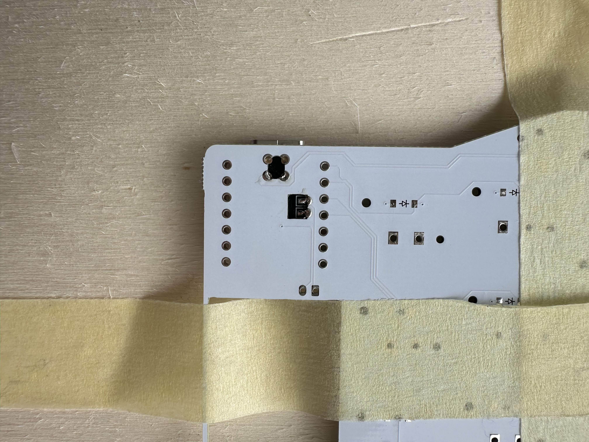
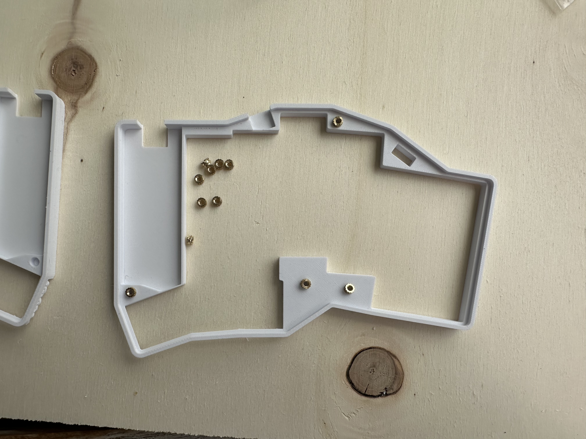

# Chalk, an ultra low profile split keyboard 

### Features
- Ultra low profile, 6mm thickness
- Zmk + Zmk Studio support
- Big 250mah Battery per split
- Hand solderable
- 42 key layout
- extremely light and portable

### Quick note about the license
This work is licensed under a
[Creative Commons Attribution-NonCommercial-ShareAlike 4.0 International License](https://creativecommons.org/licenses/by-nc-sa/4.0/).
#### This means:
- You are free to share and adapt this work, as long as you give appropriate credit
- If you adapt this work, you have to share it under the same license
- You cannot use this work for commercial purposes
- **If you just want to build this keyboard for yourself, you are totally free to do so.**

### Disclaimer (s)

- Even though this can be hand soldered, this is an advanced project, if you have never built a keyboard I would advise against this being your first project
- You will need a good soldering iron and well flowing solder, but please use lead free. Flux helps with the soldering process, so be sure to have it on hand.
- Make sure to work in a well ventilated area and wash your hands afterwards.
- These switches are super unforgiving. You will most likely not be able to desolder these once attached. Take you time and be aware that one simple mistake could ruin the whole board
- The battery is quite a tight fit. Some varients might not fit perfectly, others will. Mathematically it should, but small deviations in size might affect the fit.

## Ordering guide for the PCB
- Find the files in the /gerber folder,create a zip file and upload it to you PCB manufacturer of choice.
- Specs:
    - 1mm thickness ( the case is designed for a 1mm thick PCB ) 
    - lead free HASL ( not required but recommended )
    - Choose any color you like, but green will be cheapest in the Lead free HASL + 1mm thickness combination. If you pick an undisireable color, you will need to print a silkscreen cover and apply it with glue to the pcb later.

## Build guide

### Bom
- 1x PCB (find the files in /gerbers)
- 2x XIAO nrf52840
- 2x [250Mah Battery](https://www.amazon.de/dp/B0CRQCCT6C)
- 42x 1N4148W SMD Diodes
- 42x PG1316s switches (buy at least 50, to have some spares)
- 42x PG1316s keycaps 
- 2x [Reset switch](https://42keebs.eu/shop/parts/components/reset-switch/?attribute_type=Through-hole%202-pin%206x3&attribute_pa_colour=black)
- 2x [Power switch](https://42keebs.eu/shop/parts/components/power-switch/)
- 8x [M2 3mm depth x 3.5 mm theaded inserts](https://www.amazon.de/dp/B0D9YK4PY1)
- 8x [M3 3mm flat head screws](https://www.amazon.de/dp/B0D4557749)
- 1x Left top part of the case
- 1x Right top part of the case
- 1x Left bottom part of the case
- 1x Right bottom part of the case
- 2x Reset switch cover

### Build guide

#### Printing guide for the case.
- Use a 0.2 nozzle. This is necessary to get enough detail.
- Print everything with the highest quality settings. 
- Print the top part of the case with the top of the case facing down ( therfore Y-axis rotated by 180 degrees ), this improves the finish of the case.

### Printing & using the custom keycaps
1. Find the keycap step files in the /3dfiles folder. You can either select the keycap with 1mm or 0.5mm room for foam. The 1mm version will be quieter, while the 0.5mm preservers the 6mm overall thickness of the board.
    -  [0.5mm poron foam](https://amzn.eu/d/any7tR6)
    -  [1mm eva foam](https://amzn.eu/d/0Njnhbg)
2. Import into your slicer of choice
3. Select the highest resolution printing settings and with a 0.2mm nozzle
4. Orient the keycaps top side down
5. Scale keycap to: {x: 16.5mm y: 16.55mm}, though this might vary depending on printer and filament. I would recommend printing a grid of keycaps with differnt sclaing combinations as a first fit test.
    - **make sure no to scale uniformly**
6. Print in small batches for higher consistency, I printed max 9 at a time. Printing all at once will lead to dimensions all over the place and havint to scrap the whole batch.
7. Cut out a tiny piece of eva or poron foam (1mm or 0.5mm tickness depending on the keycap you selected ) and insert it into the keycap. Exact dimension for the foam are {x: 13.9 y: 11.1}
8. Carefully set the keycap on the switch and press down slightly, making sure not to loose the foam.

 
#### Credits
- base for this keycap is the convexfoam model by mikeholsher
-  I added supports / standoffs for the switch legs to rest on in the edges and decreased the overall height of the keycap to 3mm.

#### Buidling steps

##### Disclaimer
Most images in this guide were taken with an earlier version of the PCB, but the steps still apply. So don't worry if yours looks different. 

1. To solder the diodes, first put a blob of solder on one of the pads. 
2. Sort the diodes by direction. **This is very important**. Make sure the line on the diode on one side of them is lining up with the line on the PCB, where the diodes should go . 
3. Pick up a dioded with your tweezers and while reheating the blob of solder on the PCB, place the diode ( while presevering the correct direction) on the pad. Once you have attached all the diodes on one side, you can add solder to the other pad.    
4. Once you have all diodes attached, touch up all the solder joints by reheating and removing excess solder. **This is very important, because the room underneath the switch is quite limited and too much solder on the diode pads will prevent the switch from being inserted properly.** 
5. Now we will attach the controller. The controller should come with a pair of headers. These can be very handy to fix the controller in place while soldering. Place the controller on top of the PCB then place the package on a breadboard and then stick the headers through the pads, this keeps the controller in place while soldering.  
6. To solder the controller, only attach solder on the side of the controller. Turn down your soldering iron's temperature to 330C max. You do not want to fry the controller. Do not try so solder where the headers are. Once a few solder joints have been made, you can carefully pull out the headers with a pair or tweezers. Now touch up all the solder joints and make sure that there are no cold joints.   
7. Now turn the PCB around and drop solder into the cutouts on the back of the pcb ( the cutouts for the controller ). These joint are necessary for the battery connection and the reset switch.  
8. Now to the hard part, the switches. Please be very careful here and take you time. Check everything twice before soldering. Place a column of switches on the front of the pcb. Make sure that all switches fall into the holes. If they are not placed correclty **do not solder**. Fix the alignment first. Once all switches in the column are in place, take a piece of tape and temporarely fix them in place. Now turn the board around and drop solder into the through holes on the back for the column you are soldering. It is really important that the solder flows well. Use a very well flowing solder and make sure it had time to flow fully. I used this [solder](https://www.amazon.de/gp/product/B0CG182RLW) and had my soldering iron at 400C. After you have filled all through holes for the column, test all connections with a multimeter. If the multimeter does not show continuity at this point, **you have to reflow the solder, until it shows continuity!** Now repeat that for all columns of the board.  
9. Once all the switches are attached from the back, you can now solder the front pads. **It is very important to only add a very tiny amount of solder to the pads, otherwise it will block the switches.  Less is more!!! This is very important.** I have only attached two of the four pads that should be enough and reduces the risk of one of the pad's solder blocking the switch. 
10. Now attach the reset switch. Place the legs through the through holes. Then add solder to the top of the through holes. Afterwards, make sure to cut the legs flush on the backside, otherwise they will interfere with the backplate. 
11. Now attach the power switch. Make sure not to use too much solder. The fit between case and reset switch is quite tight. To solder the power switch, first put the power switch into its holes on the pcb. Hold it in place with a tweezer and add a bit of solder to one of the pads. Then add solder to all of the other pads.  
12. Now we will attach the battery. Make sure the battery cables are cut to lenght. There should not be too much slack, since that would use up too much space in the case. **Before soldering, please check the polarity on the battery.** Take the insulation of the ends of the cables and place them through the holes for the battery , then solder them in place. Turn the PCB around and cut of the excess of the cables. 
13. Repeat all the steps for the other half of the keyboard, by taking another PCB and flipping it around. Solder all components on this side, otherwise you end up with 2 left sides.
14. To attach the heated inserts, take the top part of the case and place the threaded inserts in the preprinted holes. Use a big attachment for your soldering iron and set its temperature to 400C. Now slowly heat of the threaded insert until it sits flush with the case. Make sure that the threaded inserts are level and did not twist or are not straight.  
15. After the previous step, place the top case on top of the pcb, turn it around and attach the bottom part of the case with the M2 screws.  
16. **Optional** Silkscreen cover: Print your silkscreen covers with maximal accuracy and carefully remove them from the printplate, they can rip easily. Take you already assebled board and brush the silkscreen (the white, green or black area depening on which color you ordered) around the switches with glue, making sure not to miss any spots or glue any of the plasitc parts of the switch 
Now carefully place the silkscreen cover on top of the glue you just applied and press down with a pair of tweezers to ensure proper adhesion. Make sure it is aligned properly with the case and there are no uncoverd areas poking through. You may wonder about the order of operations. Having the case screwed in already, while gluing the silscreencover ensures that the silscreen cover is placed correctly and avoids any misalignments. If there are loose spots around the edges you can unscrew the case and fix those by applying more adhesive to those spots. Though be carefuly not to shift the while silkscreen cover, while fixing small spots. 
17. Now insert the rubber pads in the preprinted holes on the backplate. 
18. Repeat the case assembly for the other half of the keyboard.
19. Lastly, put a little bit of adhesive on on the button of the reset switch. Now attach the reset switch cover and press it down slightly. The stl files for the reset switch cover can be found in /3dfiles. Make sure to print them at the highest quality setting to ensure accuracy. 

### Keycap assembly
1. Take on of you printed keycaps and cut out a piece of foam (1mm or 0.5mm depending on the keycap model you printed) with the dimensions 13.9mmx11.1mm
2. Place the foam inside the keycap. If you want you can use a tiny bit of adhesive to fix it in place, but I have lived without and it works fine. 
3. Now carefully place the keycap on the switch making sure the foam did not move significantly. Press down slightly to lock the keycap in position. 
4. Conduct a quick test, wether the switch works and still springs back. If that is not the case, remove the keycap and adjust either the keycap model, if that is the case for all keycaps or alter the foam dimensions if only this switch is no longer springing back..

### Keycap removal 
#### Requirements
- Have a bend pair of tweezers ready. These making grabbing under the keycap much easier.
- Have a small spudger on hand for moving the keycap. 

#### Proccess
1. Use your spudger to move the keycap slightly in the y direction. Never, I mean NEVER try this while moving the keycap in x direction.
2. While still pressing the keycap in y direction, use you tweezers to lift of the edge ( the edge in the direction you are pressing the keycap) up. 
3. This side of the keycap should now be detached from the switch. 
4. Use your tweezers to carefully remove the keycap, by also loosening the other side of the keycap.

Mike also has a [guide](https://github.com/mikeholscher/zmk-config-mikecinq?tab=readme-ov-file#about-removing-keycaps) on keycap removal, if you found mine hard to follow or badly worded.

### credits
- Thanks to [mikeholscher](https://github.com/mikeholscher) for the original base of the pg1316 footprints. I modified the to fit my design and soldering process. He also helped with many other questions and considerations around my design. Huge thanks to him for being so supportive. 
- Thanks to these tools for making creating zmk pyhsical layouts easier:
    - [Zmk pyhsical layout converter](https://zmk-physical-layout-converter.streamlit.app/)
    - [Keymap layout helper](https://nickcoutsos.github.io/keymap-layout-tools/)
